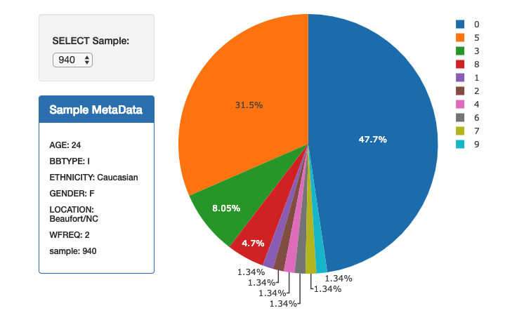
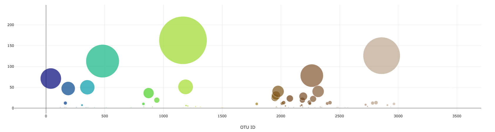

# Interactive_Visualization_Dashboard
The purpose of this project is to build an intercative dashboard to explore the [Belly Button Biodiversity DataSet](http://robdunnlab.com/projects/belly-button-biodiversity/).

## Step 1 - Plotly.js

Create a pie char using data from the samples route to display the top 10 samples.  Chart includes OTU IDs as the labels and hovertext containing the OTU lables.

Create a bubble chart that uses data from teh samples route to display each sample.  OTU ID's were used for x values and marker colors, sample values were used for y values and marker size, OTU labels were used for text values.

Flask was used to create the following available routes:
* `/metadata/<sample>`
* `/names`
* `/samples/<sample>`

## Step 2 - Heroku
Flask app is deployed to Heroku:
